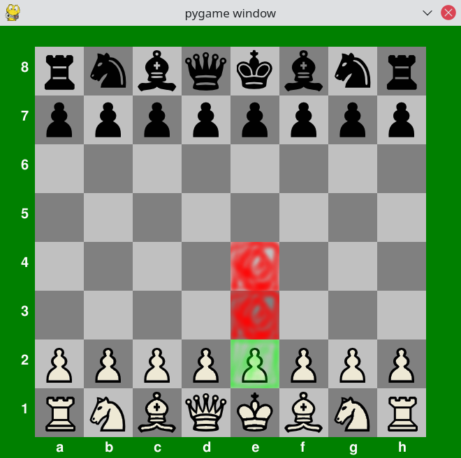

# Checkmate - A minimalist chess game

Play chess with the computer. You need Python3/PyGame to run this program.

This program is an update of the chess game https://github.com/kovzol/matt.

Authors:

  * Zoltán Kovács <zoltan@geogebra.org>
  * Benedek Kovács <kovben2004@gmail.com>

Tested by the authors and

  * Domonkos Kovács <kovdom07@gmail.com>
  * Gábor Béres

Credits:

  * http://www.clanb2k.com/cstrike12/sound/zombie_plague/survivor1.wav
  * https://www.youtube.com/user/LibraryDealer/about
  * https://www.youtube.com/watch?v=cGUoXxuGWiY

Bugs:

  * En passant and castling are not implemented (yet).
  * A draw position is not detected properly.
